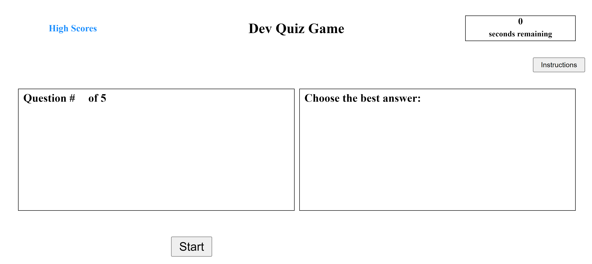
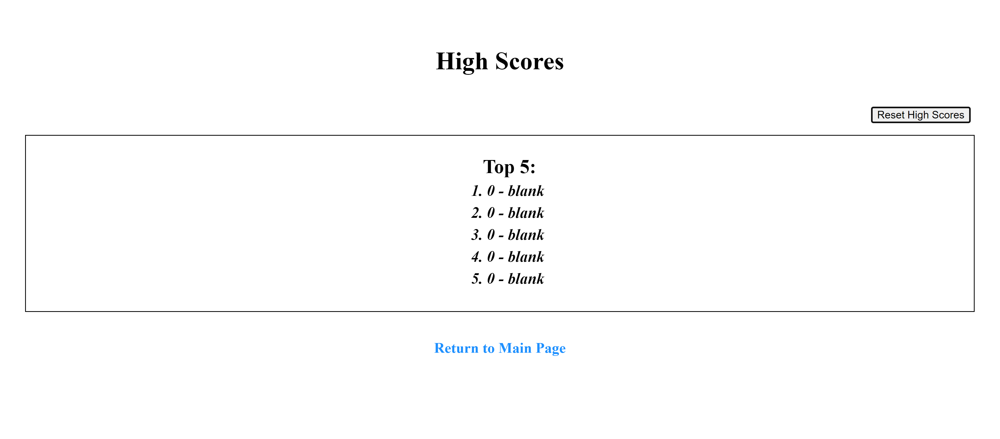

# <devQuizGame>

## Description

This website was created to test a user's knowledge of some html, css, and javascript basics.  The hope is to make the studying more fun by creating a game out of it.  Through the creation of this website I learned a lot about creating and navigating objects, as well as local storage.  I even learned some about timers and how to control them better.


## Installation

No installation needed.  Just visit deployed site and begin the quiz.
https://sotothemayor.github.io/devQuizGame/index.html

## Usage

Instructions are provided on the main page through a button titled "Instructions".  Otherwise, there are links to navigate between the quiz and highscores.  On the quiz page, you begin by clicking "Start".  On start, questions and answers are displayed and a timer is initiated for 40 seconds.  Read the question, click the appropriate answer, and click "Submit".  Each question correct awards 100 points, each question incorrect removes 5 seconds from the timer.  After the quiz ends, any remaining time will increase your score by 10 points per second.  Scores are stored on local storage, and if you have a score in the top 5, you will be prompted to add your initials to the highscores.

To access the highscores, click the link on the main page.  You can see locally stored high scores from this page, navigate back to the main quiz page, and reset the high scores if you choose.

    ```md
    
    
    ```

## Credits

Developed as homework for the UMN Bootcamp program.  Code is written from scratch, but examples provided in various classes were used to develop the concepts here.

## License

No additional licenses